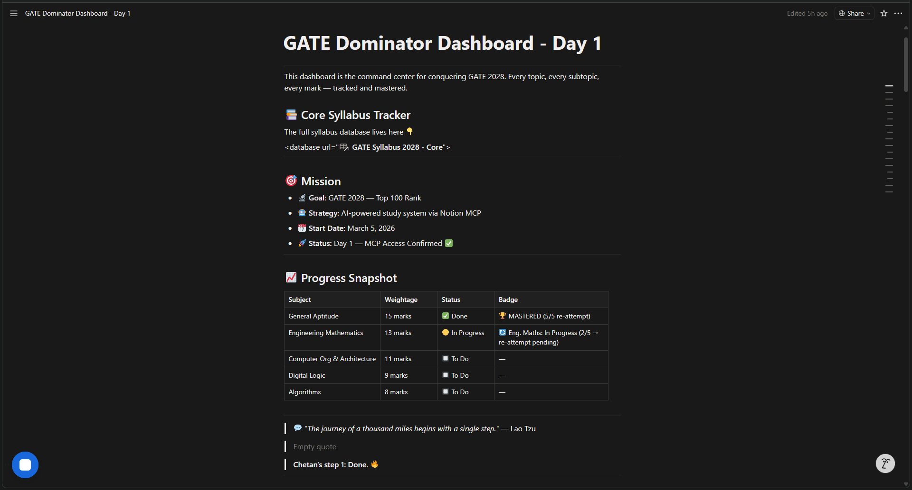
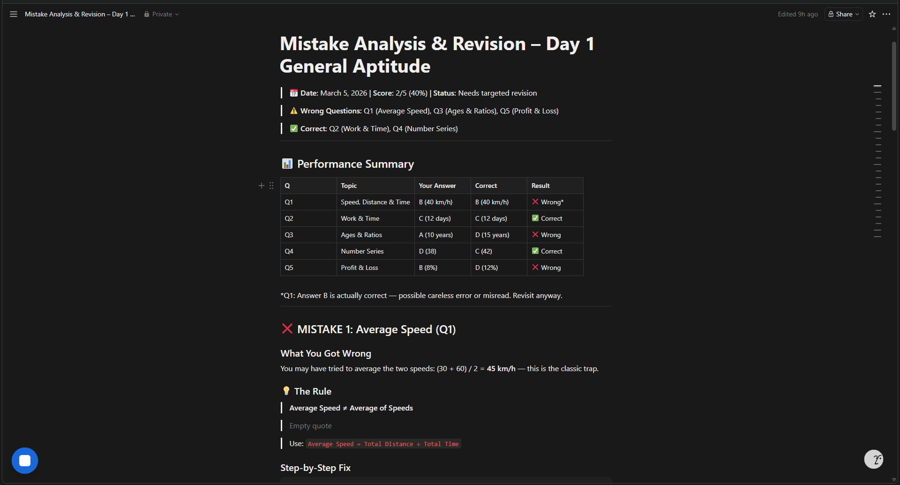
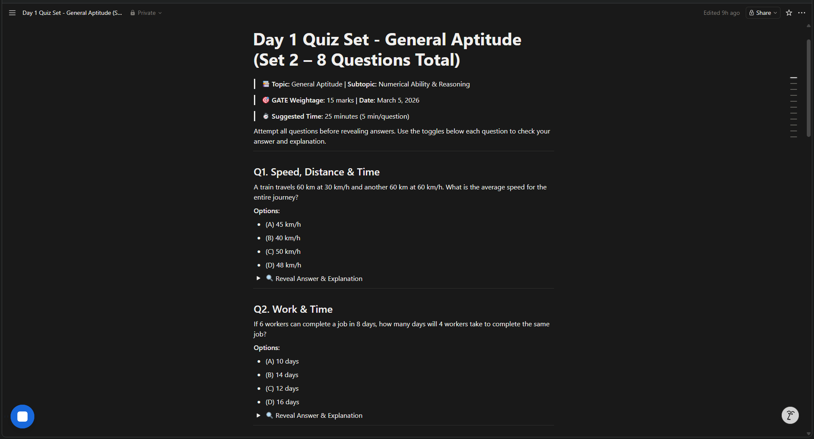
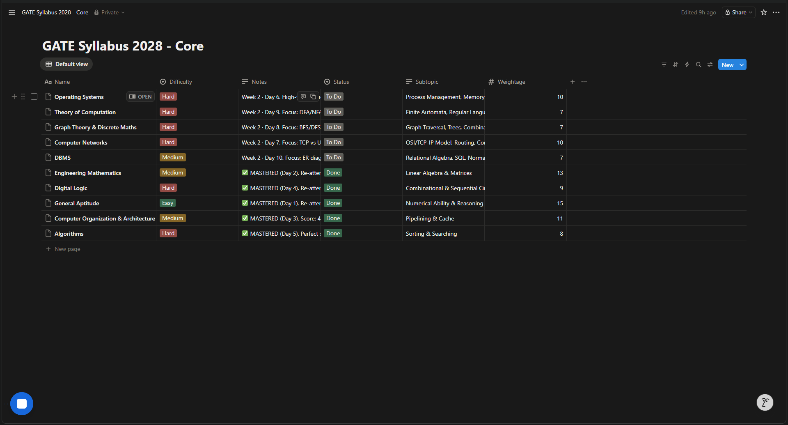

# 🏆 GATE Dominator

> Autonomous AI-powered GATE 2028 coach built with **Notion MCP + Claude** — from zero to full study system in 4 days.

[](https://www.notion.so)
[](https://www.anthropic.com)
[](https://gate.iitm.ac.in)
[](https://github.com/Chetan-code-lrca/gate-dominator)

---

## 🎯 What It Does

GATE Dominator is a **fully autonomous AI study agent** that runs inside Claude using the Notion MCP connector. You paste your quiz answers — it handles everything else.

| Feature | Description |
|---|---|
| 📅 **Weekly Study Plans** | Prioritized by weightage × difficulty, 7-day schedule auto-generated |
| 🧠 **Daily GATE Quizzes** | 5 MCQs per topic, GATE-style with trap choices, added to Quiz Bank |
| 🔍 **Mistake Analysis** | Deep breakdowns — what went wrong, the rule, step-by-step fix, GATE trap alert |
| 🎯 **Bonus Practice** | 2–3 targeted bonus questions per weak subtopic with toggle spoilers |
| 📊 **Visual Mastery Tracking** | Progress bars, marks counter, mastery badges — all live in Notion |
| 🏆 **Victory Blocks** | Auto-activates when all topics mastered — scoreboard + motivational quote |
| 🔄 **Full Closed Loop** | Attempt → Analyze → Revise → Master → Next Day — zero manual work |

---

## 📈 Week 1 Results

| Topic | Marks | First Attempt | Final Score | Status |
|---|---|---|---|---|
| General Aptitude | 15 | 2/5 (40%) | 5/5 (100%) | 🏆 Mastered |
| Engineering Mathematics | 13 | 2/5 (40%) | 5/5 (100%) | 🏆 Mastered |
| Computer Org & Architecture | 11 | 4/5 (80%) | 4/5 (80%) | 🏆 Mastered |
| Digital Logic | 9 | 3/5 (60%) | 5/5 (100%) | 🏆 Mastered |
| Algorithms | 8 | **5/5 (100%) 🔥** | 5/5 (100%) | 🏆 Mastered |
| **TOTAL** | **56** | — | **56/56** | **✅ Week 1 Complete** |

---

## 🎥 Live Demo

[▶️ Watch 5-min walkthrough (Loom)](https://www.loom.com/share/YOUR-LOOM-LINK-HERE)

---

## 🏗️ Architecture

```
User (Chetan)
    │
    │  Pastes quiz answers / commands
    ▼
Claude AI (Agent)
    │
    │  Notion MCP API calls
    ▼
Notion MCP Connector
    │
    ├──▶ GATE Syllabus 2028 - Core  (Syllabus DB)
    │         Topics · Marks · Status · Notes
    │
    ├──▶ GATE Quiz Bank 2028  (Quiz DB)
    │         Questions · Answers · Results · Mastery
    │
    ├──▶ Mistake Analysis Pages  (Auto-generated)
    │         Scorecard · Fixes · Bonus Qs
    │
    └──▶ GATE Dominator Dashboard  (Command Centre)
              Progress bars · Badges · Quotes · Victory block
```


---

## 🧠 The Brain — Master System Prompt

The entire agent runs from a **single prompt** pasted into Claude with Notion MCP connected.

👉 **[View full system prompt →](system-prompt.md)**

Key design principles:
- **Exact database targeting** — hardcoded names prevent wrong-workspace writes
- **Mastery gate** — score ≥ 4/5 required before topic flips to Done
- **Atomic updates** — every quiz attempt triggers 5 simultaneous Notion updates
- **Self-documenting** — analysis pages auto-link to dashboard, quiz bank, and syllabus

---

## 🗂️ Notion Workspace Structure

```
GATE Dominator Workspace
├── 📊 GATE Dominator Dashboard
├── 📚 GATE Syllabus 2028 - Core  (Database)
├── 🧠 GATE Quiz Bank 2028  (Database)
├── 🗓️ Weekly Study Plan – Week 1 (March 5–11, 2026)
├── 🗓️ Weekly Study Plan – Week 2 (March 10–16, 2026)
└── 🔍 Analysis Pages/
    ├── Mistake Analysis & Revision – Day 1 General Aptitude
    ├── Mistake Analysis & Revision – Day 2 Engineering Mathematics
    ├── Mistake Analysis & Revision – Day 3 COA
    ├── Mistake Analysis & Revision – Day 4 Digital Logic
    └── Mistake Analysis & Revision – Day 5 Algorithms
```

---

## 🚀 How to Use It Yourself

### Prerequisites
- Claude.ai account (Pro recommended)
- Notion account with MCP connector enabled
- 5 minutes to set up the workspace

### Setup Steps

1. **Duplicate the Notion template** *(link coming soon)*
2. **Connect Notion MCP** in Claude → Settings → Connectors
3. **Paste the system prompt** from [`system-prompt.md`](system-prompt.md) into Claude
4. **Start with:** `"Generate Week 1 Study Plan"` — the agent builds everything automatically

### Daily Workflow

```
1. Open your Day N quiz page in Notion
2. Study the topic (2–3 hours)
3. Attempt all 5 questions
4. Paste to Claude: "Analyze my Day N [Topic] quiz: Q1:_, Q2:_, ..."
5. Agent scores, analyzes, updates all databases, refreshes dashboard
6. If score < 4/5 → study analysis page → re-attempt
7. Repeat until mastered → move to next topic
```

---

## 📸 Screenshots

| Dashboard Victory | Analysis Page | Quiz Toggle |
|---|---|---|
|  |  |  |

| Syllabus All Done | Week 1 Scoreboard |
|---|---|
|  |  |

---

## 📁 Repository Structure

```
gate-dominator/
├── README.md              ← This file
├── system-prompt.md       ← Full agent system prompt
├── architecture.png       ← System architecture diagram
└── screenshots/
    ├── dashboard-victory.png
    ├── analysis-page.png
    ├── quiz-toggle.png
    ├── syllabus-done.png
    └── victory-block.png
```

---

## 🧑‍💻 Built By

**Inaganti Chetan** — 2nd-year B.Tech student, GATE 2028 aspirant

Built as a submission for the **Notion MCP Challenge** — demonstrating how Claude + Notion MCP can replace an entire coaching system with a single AI agent.

---

## 📄 License

MIT — use it, fork it, build your own subject-specific version.

---

> *"When something is important enough, you do it even if the odds are not in your favor."* — Elon Musk 🔥
